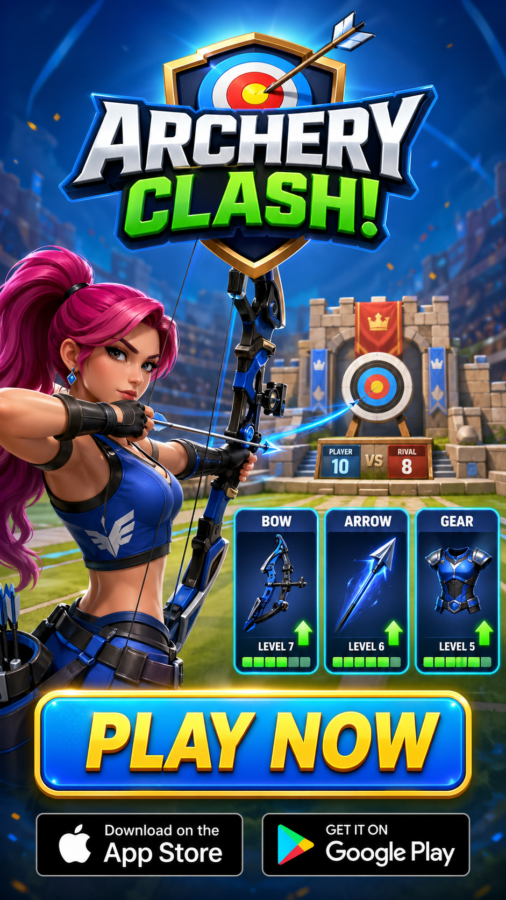

<div align="center">

# 🏆 VOODOO &times; ANTHROPIC HACK 2026

### **VoodRadar — AI ad-intelligence platform for mobile-game publishers**

[](#)

[](https://www.python.org/)
[](https://fastapi.tiangolo.com/)
[](https://react.dev/)
[](https://www.anthropic.com/)
[](https://ai.google.dev/)
[](https://scenario.com/)

**Type a mobile-game name → get a full competitive creative dossier**
**(deconstructed competitor ads, archetypes, ready-to-render briefs)**
**in 3–5 minutes, grounded in fresh [SensorTower](https://sensortower.com/) signals.**


*↑ Four of the per-game **branded endcards** VoodRadar pre-generates (GPT Image 2 for the static frame → Kling i2v for the 3-second animation). Each title's endcard is rendered once and grafted onto every variant via `lastFrameImage` chaining, so a 3-clip Kling video transitions into a CTA frame that's already on-brand for the game.*

</div>

---

## TL;DR — what the jury saw

> **As a Voodoo PM managing dozens of live games, I want a tool that flags which titles need a creative refresh, deconstructs what is currently winning in their category, and produces a small set of on-brand video variants I can take to A/B test — without spending a half-day per title.**

VoodRadar turns a single game name into a full competitive creative dossier in **3 to 5 minutes** (rendering each brief into a finished video is a separate, optional step that takes another few minutes per variant):

1. **Pulls** the live [SensorTower](https://sensortower.com/) top-creatives feed (4 networks × 7 countries) and indexes hundreds of ads.
2. **Deconstructs** every creative with **Gemini Pro Vision** — extracting the hook, the scene flow, the text overlays, the CTA, the palette, the audience proxy.
3. **Clusters** the corpus into archetypes via signal-weighted scoring (SoV velocity, derivative spread, freshness, network diversity).
4. **Scores** each archetype against the target Game DNA on visual / mechanic / audience axes (Claude Opus 4.7).
5. **Authors** per-archetype creative briefs with explicit **audio directives** — including bespoke, high-tempo narration scripts written for each variant (no Lorem-Ipsum filler, no generic copy).
6. **Renders** 3 hero frames via **Scenario (gpt-image-2)**, then **3 parallel 5-second Kling i2v video calls**, with explicit `firstFrame` / `lastFrame` chaining on the final clip so it transitions seamlessly into the **pre-generated game-specific endcard**.
7. **Mixes** a multi-layer audio track via `ffmpeg filter_complex`: music bed (auto-ducked to 25%) + Opus-authored narration → OpenAI TTS + timestamp-spliced game SFX.
8. **Outputs** an 18-second branded MP4 ready to upload to Meta Ads / TikTok.

A design choice we leaned on heavily: every Gemini call is **persisted in a knowledge base** keyed by `creative_id`. The first analysis pays Gemini; subsequent ones (cross-game, cross-week, cross-machine) hit disk in <10 ms. The repo ships with **499 ads pre-deconstructed**, so a fresh clone has a usable corpus from the start.

---

## The methodology — how we actually pick winners

### 1 · Market scan & trend signals

We don't just rank by raw Share-of-Voice. SensorTower's top-creatives feed is heavily skewed to long-running brand campaigns; what a Voodoo PM actually needs is **what's working *right now*** in their category. So we score every creative on a weighted composite of four signals:

| Signal | What it captures | Source |
|---|---|---|
| **`sov_velocity`** | 4-week derivative of share-of-voice for the *advertiser*. Positive velocity = the creative's parent campaign is gaining ground; negative = decaying. | `/v1/unified/ad_intel/network_analysis` per app_id, sliced into rolling weekly buckets. |
| **`derivative_spread`** | Variance of velocity *across networks*. High spread = the campaign is exploding on one network and flat on others (signal of channel-specific virality). Low spread = uniform, less informative. | Computed from the same series, network-level slices. |
| **`freshness`** | Days since `first_seen_at`. Decay function: full weight ≤ 7 days, half-weight at 30 days, ~0 at 90 days. Catches "this hook just launched and is already top-N". | `ad_unit.first_seen_at` from creatives_top. |
| **`network_diversity`** | Number of distinct networks running the same `phashion_group` (visual hash). Genuine winners propagate across Meta / TikTok / AppLovin. Single-network outliers are usually network-specific tests. | `phashion_group` + `network` fields. |

Final score is `(0.45 × velocity_norm) + (0.20 × spread_norm) + (0.20 × freshness_norm) + (0.15 × diversity_norm)`. The weights are heuristic — picked to favour velocity over freshness over diversity — and would benefit from being calibrated against a labelled set of historical winners in a follow-up. Implementation in [`app/analysis/archetypes.py`](app/analysis/archetypes.py).

The intent is to surface the handful of ads where the signal genuinely justifies attention rather than dumping a full top-50 list on the PM, with each score component visible on the card so the choice is auditable.

### 2 · Gemini deconstruction — the persistent corpus

Every selected creative goes through **Gemini 2.5 Pro Vision** (1M context, native multi-frame video understanding). The prompt asks for a **structured Pydantic schema** so we never deal with prose:

```python
class DeconstructedCreative(BaseModel):
    creative_id: str
    hook_frame: HookFrame                # 0-3s: visual subject + spoken hook + on-screen text
    scene_flow: list[SceneBeat]          # 5-8 beats with timestamps + camera + action
    text_overlays: list[TextOverlay]     # every text-on-frame with timing + position
    voiceover_transcript: str | None     # full transcript when audio present
    cta_frame: CtaFrame                  # the final-2s endcard structure
    palette: ColorPalette                # 5 dominant colors with hex + role
    emotional_pitch: Literal[
        "satisfaction", "fail", "curiosity", "social-proof",
        "tutorial", "live-action-ugc", "in-game", "animation", "other",
    ]
    archetype_label: str                 # free-form, e.g. "live-action UGC reaction"
    audience_proxy: str                  # "20-something casual gamer, browsing TikTok"
    pacing_score: float                  # 0-1, normalized scene-cuts-per-second
```

Each deconstruction is written to `data/cache/deconstruct/<creative_id>.json` and **never recomputed** unless the file is removed. After the hackathon, the knowledge base contains **499 creatives × ~3 KB each ≈ 2 MB of structured market intelligence** built up over the hackathon weekend. A `scripts/scan_top_competitors.py` cron is set up to keep it fresh on a weekly cadence.

This is what makes the second analysis on a Voodoo title **10× cheaper than the first** — the per-archetype clustering reads from disk instead of re-paying Gemini.

### 3 · Brief generation — Opus with explicit audio directives

The clustering step picks the 3 archetypes that score highest **for this specific game** (game-fit ranker, also Opus, scoring on visual / mechanic / audience axes). Each goes to a **separate Opus 4.7 call** that produces a fully-typed `CreativeBrief`:

- 3 storyboard frames (each with prompt for Scenario, plus negative prompt)
- per-frame text overlays
- final CTA copy
- **`audio_directive`** — the section of the prompt that drives the audio output
  - `vibe_track`: which emotional pitch to match for the music bed
  - `narration_script`: a bespoke 3-sentence script Opus writes specifically for the variant — short cadence, punchy nouns, structured as setup → reveal → CTA, calibrated to the snappy delivery that performs on TikTok / Reels
  - `sfx_cues`: 3-5 timestamped game-feel sound effects (`whoosh @ 1.2s`, `drop @ 4.8s`, `chime @ 17.5s`)

Including this directive in the prompt gave us audio that fits the casual-arcade tone Voodoo ads typically run on, rather than a flat reading of the text overlays. We compared both approaches internally before settling on this design.

### 4 · Video generation — 3 parallel calls + first/last frame chain

The video-rendering step takes one brief and produces an 18-second branded MP4. End-to-end time depends mostly on how busy the Scenario backend is — typically a few minutes per variant when run uncached:

```
                      ┌─────── Scenario gpt-image-2 (parallel ×3) ───────┐
                      │                                                   │
brief.frame_prompts ──┼── frame_0.png ──┐                                 │
                      ├── frame_1.png ──┼─── 3 hero frames (1080×1916)    │
                      └── frame_2.png ──┘                                 │
                                                                          │
                      ┌─────── Kling i2v (parallel ×3) ──────────────────┘
                      │
clip_0  =  i2v(frame_0)                              ← 5s, no constraints
clip_1  =  i2v(frame_1)                              ← 5s, no constraints
clip_2  =  i2v(                                      ← 5s, BUT:
              firstFrameImage = frame_2,
              lastFrameImage  = endcard_first_frame  ← grafts onto the endcard
          )
                      │
                      ▼
ffmpeg concat:  clip_0  ⊕  clip_1  ⊕  clip_2  ⊕  endcard.mp4    (18s total)
                      │
                      ▼
ffmpeg filter_complex (multi-layer audio mix — section 5)
                      │
                      ▼
                 final.mp4
```

The **first/last-frame chaining on `clip_2`** is what gives the cut into the branded endcard a clean transition. Kling's i2v supports passing both `firstFrameImage` and `lastFrameImage` (in **Fast** mode — Rich/2.6-Pro mode rejects the combo when `generateAudio=true`, so in that mode we accept a hard cut in exchange for native diegetic audio). We extract the endcard's first frame at pipeline-init time and reuse it across every variant for the same game.

Implementation in [`app/creative/scenario.py`](app/creative/scenario.py) (the API client) and [`api/main.py:render_variant_video`](api/main.py) (the orchestrator).

### 5 · Audio mixing — multi-layer ffmpeg `filter_complex`

Three layers, mixed down into one stereo track:

| Layer | Source | Volume | Strategy |
|---|---|---|---|
| **Music bed** | Stock track from `data/cache/audio/library/<vibe>.mp3` (Pixabay CC0). The vibe is picked from the brief's `emotional_pitch` (`satisfaction` → energetic chiptune, `fail` → comedic glitch, `live-action-ugc` → upbeat lo-fi, etc). | 25% | Looped to video duration with `apad=whole_dur=...` so it never truncates. **Auto-ducks** to 25% the moment voice is enabled. |
| **Voiceover** | OpenAI TTS (`alloy` voice) reading the **Opus-authored bespoke narration** — *not* the text overlays. The narration is cached on disk per `(brief_hash, voice_id)` so re-rolls are free. | 100% | Padded with silence to the full video duration so `amix` can't drop early. |
| **Game SFX** | 5 short stems (`whoosh.mp3`, `swoosh.mp3`, `drop.mp3`, `chime.mp3`, `brand.mp3`) timestamp-spliced at the brief's `sfx_cues`. | 80% | Each splice uses `adelay=<ms>|<ms>` to hit the correct beat, then `apad` + `atrim` to align. |

The filter graph is built dynamically: each enabled layer gets its own input slot, its own chain, and a label that feeds into the final `amix=inputs=N`. An early implementation used `-shortest`, which truncated 18s videos down to the 4s narration; the current version `apad`s every audio source to the video length so `amix` aligns correctly. Implementation in [`api/main.py:_try_apply_audio_layers`](api/main.py).

The UI exposes three toggles (Music / Voice / SFX) and the backend keeps a silent copy of the assembled video as `.silent.mp4`, so the architecture supports re-mixing audio without re-running the video pipeline. Validating that fast-path end-to-end was on our shortlist for the hackathon and remains a follow-up — the rendering itself currently runs the full pipeline on each click.

### 6 · Endcards — pre-generated, animated, per-game

Every Voodoo title gets a **branded endcard** generated *once* and reused across every variant:

<div align="center">

| Static frame (GPT Image 2) | Animated (Kling i2v, 3s) |
|:---:|:---:|
|  |  |
| **Step 1**: GPT Image 2 receives the game's icon + Game DNA palette + a fixed prompt template ("mobile game endcard, [game] logo centered, 'Play Now' CTA button, App Store badge, [palette] background, vertical 9:16"). Output cached as PNG. | **Step 2**: Kling i2v animates it into a 3-second loop (subtle parallax + CTA pulse). Cached as MP4. The first frame is what `clip_2` of every variant grafts onto via `lastFrameImage`. |

</div>

Pipeline scripts: [`scripts/generate_endcards.py`](scripts/generate_endcards.py) for the static gen, [`scripts/animate_endcards.py`](scripts/animate_endcards.py) for the animation pass (with auto-trim of the empty 2 last seconds + 429 backoff). The `--all` flag is idempotent — already-animated games are skipped.

We pre-generated 17 animated endcards covering every Voodoo title in our demo set. Adding a new one is `uv run python -m scripts.generate_endcards --game "<game name>" && uv run python -m scripts.animate_endcards --game "<game name>"`.

---

## Architecture

```
                  ┌─────────────────────────────────────────┐
                  │  Frontend (React + TanStack Router)     │
                  │  /  /voodoo  /ads  /insights  /weekly   │
                  │  /competitive  /competitor/$appId       │
                  │  /performance  /geo  /ad/$id            │
                  └─────────────────┬───────────────────────┘
                                    │ HTTP + Server-Sent Events
                  ┌─────────────────▼───────────────────────┐
                  │  FastAPI bridge  (api/main.py)          │
                  │  /api/report  /api/variants/render-video│
                  │  /api/weekly-report  /api/creatives/{id}│
                  │  /api/competitor/{app_id}               │
                  │  /api/report/run/stream  (SSE pipeline) │
                  └────┬───────┬──────┬──────┬──────────────┘
                       │       │      │      │
                       ▼       ▼      ▼      ▼
              ┌───────────┐ ┌──────┐ ┌──────┐ ┌──────────┐
              │SensorTower│ │Gemini│ │Opus  │ │Scenario  │
              │ ad-intel  │ │ Pro  │ │ 4.7  │ │img + i2v │
              └─────┬─────┘ └───┬──┘ └───┬──┘ └─────┬────┘
                    │           │        │          │
                    └───────────┴────────┴──────────┘
                                     │
                            ┌────────▼─────────────────┐
                            │      data/cache/         │
                            │  reports/    game_dna/   │
                            │  briefs/     deconstruct/│
                            │  endcards/   videos/     │
                            │  audio/      scenario/   │
                            │  voodoo/     sensortower/│
                            └──────────────────────────┘
```

**Knowledge base** (`data/cache/deconstruct/`) is where the persistence lives: every Gemini call keyed by `creative_id`, cached on disk. The first analysis pays Gemini, subsequent ones hit disk in <10 ms. A weekly cron of `scripts/scan_top_competitors.py` keeps it fresh.

---

## Repo layout

```
api/main.py                      # FastAPI: 20+ endpoints + SSE pipeline runner
app/
├── models.py                    # Pydantic data contract (the lingua franca)
├── pipeline.py                  # 10-step pipeline orchestrator
├── analysis/
│   ├── game_dna.py              # SensorTower meta + Gemini Vision on screenshots
│   ├── deconstruct.py           # Gemini Pro Vision per-creative dossier
│   ├── archetypes.py            # signal-weighted clustering (velocity / spread / freshness)
│   └── game_fit.py              # Opus per-archetype game-fit scoring
├── creative/
│   ├── brief.py                 # Opus brief authoring with audio directives
│   ├── scenario.py              # Scenario REST client (img + i2v + lastFrame chaining)
│   └── video_brief.py           # Veo 3 alt path
└── sources/
    ├── sensortower.py           # SensorTower /ad_intel + /search wrapper
    └── voodoo.py                # Voodoo catalog harvester (50 games)

front/                           # React app (TanStack Router + Tailwind + shadcn/ui)
├── src/components/dashboard/    # Page-level views (Insights, AdLibrary, …)
├── src/components/insights/     # GeneratedAdSection, LiveAnalysisView, …
├── src/lib/                     # API hooks + game / pipeline-runs context
└── src/routes/                  # File-based routing (incl. /competitor/$appId)

scripts/
├── precache.py                  # Pre-bake a HookLensReport for one game
├── precache_voodoo_ads.py       # Snapshot the 50-game Voodoo portfolio
├── scan_top_competitors.py      # Backfill the deconstruction knowledge base
├── generate_endcards.py         # GPT Image 2 → branded endcard PNG
├── animate_endcards.py          # Kling i2v → animated 3-second endcard MP4
└── generate_demo_video.py       # CLI multi-clip ad assembly (pre-React)

data/cache/                      # All cached state (selectively gitignored)
├── reports/                     # 21 cached HookLensReports (~0.6 MB)
├── deconstruct/                 # 499 Gemini deconstructions (~1.9 MB)
├── endcards/                    # 17 animated game endcards (PNG + 3-second MP4)
├── voodoo/                      # 50-game Voodoo catalog + portfolio snapshot
├── sensortower/                 # Raw SensorTower API responses
├── audio/library/               # Stock music keyed by emotional pitch
├── audio/sfx/                   # Game SFX stems
└── audio/tts/                   # OpenAI TTS cache
```

---

## Running locally

### Prerequisites

- Python 3.12 (pinned in `.python-version`)
- [`uv`](https://github.com/astral-sh/uv) for package management
- Node 20+ for the frontend
- `ffmpeg` + `ffprobe` on `$PATH`
- API keys in `.env`:
  - `SENSORTOWER_API_KEY`
  - `GEMINI_API_KEY` (Gemini Pro Vision)
  - `ANTHROPIC_API_KEY` (Claude Opus 4.7)
  - `SCENARIO_API_KEY` + `SCENARIO_API_SECRET` (image + video generation)
  - `OPENAI_API_KEY` (TTS voiceovers)

### One-liner setup

```bash
uv pip install -e ".[dev]"
cd front && npm install --legacy-peer-deps && cd ..

# Terminal 1 — backend
uv run uvicorn api.main:app --reload --port 8000

# Terminal 2 — frontend
cd front && npm run dev          # → http://localhost:8080
```

The cached state ships with the repo (~125 MB tracked), so a fresh clone has 21 analyzed games + 499 deconstructed ads + 17 animated brand endcards available **without paying any API**.

### Re-running the full pipeline on a new game

```bash
uv run python -m scripts.precache "<game name>"
```

Burns ~$0.50–$1 in API calls and takes 3–5 minutes. The result lands in `data/cache/reports/<app_id>_e2e.json` and shows up in the React UI immediately.

### Refreshing the knowledge base

```bash
uv run python -m scripts.scan_top_competitors --concurrency 5
```

Walks every cached SensorTower creative, deconstructs the ones not yet in the knowledge base. Idempotent — second run is a no-op.

---

## Demo paths

- **Hero report** → http://localhost:8080/insights → "Crowd City"
  (21 cached reports available; Crowd City has the most polished variants + an animated endcard).
- **Generate Ad** → on any cached report, click **Generate Ad** in the "Generated ad video" section. End-to-end render takes a few minutes per variant (parallel Scenario calls + Kling i2v are the bottleneck).
- **Knowledge base** → http://localhost:8080/weekly → 499 deconstructed ads, distribution by emotional pitch, click any tile for its Gemini dossier on `/ad/<id>`.
- **Competitor deep-dive** → http://localhost:8080/competitive → click any top advertiser → live SensorTower fetch of their full ad inventory + cached deconstructions.

---

## Tech stack

| Layer | Tool |
|---|---|
| Backend | Python 3.12 · FastAPI · Pydantic 2 · httpx async · asyncio + Semaphore |
| Frontend | React 19 · Vite · TanStack Router · TanStack Query · Tailwind CSS · shadcn/ui |
| Data | SensorTower (ad-intel + search + apps) · App Store screenshots (CDN) |
| AI | Gemini 2.5 Pro Vision · Claude Opus 4.7 · OpenAI TTS · Scenario (gpt-image-2 + Kling O1/2.6-Pro i2v + Veo 3) |
| Video | ffmpeg (concat demuxer + filter_complex amix) |
| Audio | OpenAI TTS · Pixabay CC0 / Mixkit no-attribution |
| Caching | Flat JSON files keyed by creative_id / app_id / archetype / hash |
| Streaming | Server-Sent Events for live pipeline progress |

---

## One last hero shot

<div align="center">


*An **Archery Clash** ad VoodRadar produced for the demo: 3 Kling i2v clips concatenated, with a `lastFrame` graft into the branded endcard. Opus-authored narration sits on top of an auto-ducked music bed and three timestamp-spliced game SFX. The pipeline runs end-to-end from the brief to this MP4.*

</div>

---

## Credits

Built for **Voodoo &times; Anthropic Hack 2026** in 30 hours by **[Tom](https://github.com/Tooom123), Mehdi and myself**.

Powered by Anthropic credits (Claude Opus 4.7), Google AI credits (Gemini 2.5 Pro Vision), and [Scenario](https://www.scenario.com/) credits (gpt-image-2 + Kling O1/2.6-Pro i2v + Veo 3). [SensorTower](https://sensortower.com/) data used under hackathon-sponsor credentials.

Audio assets sourced from the royalty-free [Pixabay](https://pixabay.com/) library, mapped to emotional-pitch slots in `data/cache/audio/library/README.md`.

🏆 **Track 3 — Market Intelligence — 1st place — Voodoo &times; Anthropic Hack 2026.**
